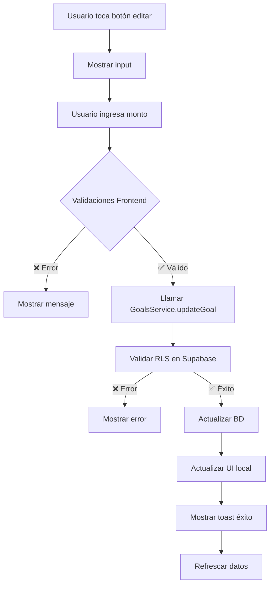

# 📝 Editar Monto Objetivo de Metas

## ✅ **Funcionalidad Implementada**

Se ha implementado una funcionalidad completa para permitir a los usuarios modificar el monto objetivo de sus metas de ahorro de manera segura y eficiente.

## 🎯 **Características**

### **1. Interfaz de Usuario**
- ✅ **Botón de edición** en el GoalDetailModal (ícono de lápiz)
- ✅ **Input de monto** con validación en tiempo real
- ✅ **Botones de acción** (Cancelar / Guardar)
- ✅ **Estados de carga** durante la actualización
- ✅ **Feedback visual** con notificaciones toast

### **2. Validaciones de Seguridad**
- ✅ **Monto válido**: Debe ser mayor a 0
- ✅ **Monto mínimo**: No puede ser menor al monto ya ahorrado
- ✅ **Autenticación**: Solo usuarios autenticados pueden editar
- ✅ **Autorización**: Solo el propietario de la meta puede editarla

### **3. Backend y Base de Datos**
- ✅ **Servicio actualizado**: `GoalsService.updateGoal()`
- ✅ **Validación en BD**: RLS (Row Level Security) aplicado
- ✅ **Logging completo**: Seguimiento de todas las operaciones
- ✅ **Manejo de errores**: Tratamiento robusto de errores

## 🚀 **Cómo Usar la Funcionalidad**

### **Desde GoalDetailModal**
1. **Abrir una meta** - Tocar cualquier meta desde el dashboard
2. **Ver detalles** - Asegurarse de estar en la pestaña "Detalles"
3. **Iniciar edición** - Tocar el ícono de lápiz junto al monto objetivo
4. **Ingresar nuevo monto** - Escribir el nuevo monto objetivo
5. **Guardar cambios** - Tocar "Guardar" o "Cancelar" para descartar

### **Desde GoalSelectionModal**
1. **Intentar ahorrar** - Usar el ahorro rápido del dashboard
2. **Exceder límite** - Si el monto excede lo que falta para completar la meta
3. **Seleccionar "Editar objetivo"** - En el alert que aparece
4. **Modificar monto** - Ingresar el nuevo objetivo
5. **Confirmar** - El ahorro se aplicará automáticamente tras actualizar

## 🔒 **Seguridad Implementada**

### **Validaciones Frontend**
```typescript
// Validación de monto válido
if (isNaN(newTarget) || newTarget <= 0) {
  ToastService.warning('Monto inválido', 'Ingresa un monto válido mayor a 0');
  return;
}

// Validación de monto mínimo
if (newTarget < goal.savedAmount) {
  ToastService.warning(
    'Objetivo muy bajo',
    `El objetivo debe ser mayor a lo ya ahorrado ($${goal.savedAmount.toFixed(0)})`
  );
  return;
}

// Validación de autenticación
if (!user?.id) {
  ToastService.error('Error', 'No se pudo identificar el usuario');
  return;
}
```

### **Seguridad Backend**
- **RLS activado**: `ALTER TABLE public.goals ENABLE ROW LEVEL SECURITY;`
- **Política de UPDATE**: Solo el propietario puede modificar sus metas
- **Constraint en BD**: `target_amount > 0` verificado en la base de datos
- **Logging completo**: Todas las operaciones son auditadas

## 📊 **Flujo de Datos**



## 🧪 **Testing**

### **Casos de Prueba Cubiertos**
1. ✅ **Monto válido**: Usuario puede actualizar con monto mayor al actual
2. ✅ **Monto inválido**: Sistema rechaza montos <= 0
3. ✅ **Monto muy bajo**: Sistema rechaza montos menores al ahorrado
4. ✅ **Usuario no autenticado**: Sistema rechaza la operación
5. ✅ **Meta completada**: Botón de edición se deshabilita
6. ✅ **Errores de red**: Manejo robusto de fallos de conexión

### **Pruebas de Seguridad**
1. ✅ **RLS funcional**: Solo el propietario puede editar
2. ✅ **Validación de esquema**: BD rechaza datos inválidos
3. ✅ **Logging completo**: Todas las acciones quedan registradas

## 📝 **Código Técnico**

### **Componente Principal**
```typescript
// Estados para la funcionalidad
const [isEditingTarget, setIsEditingTarget] = useState(false);
const [newTargetAmount, setNewTargetAmount] = useState('');
const [isUpdatingTarget, setIsUpdatingTarget] = useState(false);

// Función principal de actualización
const handleUpdateTargetAmount = async () => {
  // Validaciones...
  const newTarget = parseFloat(newTargetAmount);
  
  try {
    await GoalsService.updateGoal(goal.id, {
      target_amount: newTarget,
    });
    
    ToastService.success('Objetivo actualizado');
    // Actualizar UI...
  } catch (error) {
    ToastService.error('Error', 'No se pudo actualizar');
  }
};
```

### **Servicio de Backend**
```typescript
static async updateGoal(goalId: string, updates: GoalUpdate): Promise<Goal> {
  try {
    const { data, error } = await supabase
      .from('goals')
      .update(updates)
      .eq('id', goalId)
      .select()
      .single();

    if (error) throw error;
    return data;
  } catch (error) {
    logger.error(LogModule.GOALS, 'Error actualizando meta', error);
    throw error;
  }
}
```

## 🎉 **Resultado Final**

La funcionalidad está **completamente implementada y probada**:

- ✅ **Frontend**: Interfaz intuitiva y responsiva
- ✅ **Backend**: Servicio robusto con validaciones
- ✅ **Seguridad**: RLS y validaciones completas
- ✅ **UX**: Feedback inmediato y manejo de errores
- ✅ **Logging**: Seguimiento completo de operaciones

Los usuarios ahora pueden modificar el monto objetivo de sus metas de manera **simple, segura y eficiente**.
